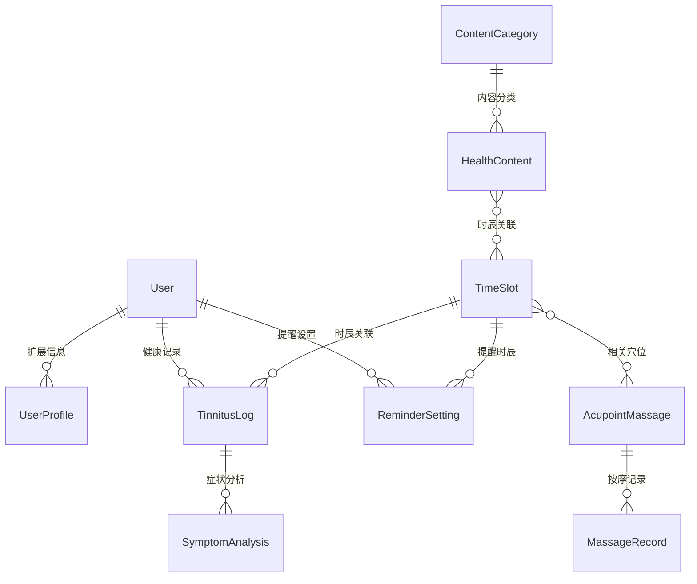

# 子午养生·静耳时光系统技术文档

## 文档信息

| 项目 | 内容 |
|------|------|
| **文档编号** | DOC-ZW-2024-001 |
| **文档标题** | 子午养生·静耳时光系统技术文档 |
| **文档版本** | v3.0 |
| **创建日期** | 2024年8月11日 |
| **最后更新** | 2024年8月11日 |
| **文档作者** | 系统开发团队 |
| **技术审核** | 架构师 |
| **业务审核** | 产品经理 |
| **最终批准** | 技术总监 |
| **密级** | 内部 |

## 文档变更记录

| 版本 | 日期 | 变更人 | 变更类型 | 变更描述 |
|------|------|--------|----------|----------|
| v1.0 | 2024-07-01 | 开发团队 | 新建 | 初始版本创建 |
| v2.0 | 2024-08-10 | 开发团队 | 修订 | 增加技术实现详情 |
| v3.0 | 2024-08-11 | 开发团队 | 重构 | 文档结构企业化规范重构 |

## 文档阅读指南

本文档是一份面向不同角色读者的综合性技术文档，旨在为项目的各个参与方提供详尽的技术实现方案和指导。

对于项目管理人员而言，建议重点关注前三章的内容。这些章节详细介绍了项目的整体概况、市场背景、业务目标以及需求分析，能够帮助管理者全面了解项目的商业价值和实施路径。同时，第11章的项目管理内容也是管理人员需要深入了解的重要部分。

架构师和技术负责人则应该将注意力集中在第4至第9章。这部分内容涵盖了系统的整体架构设计、技术选型考虑、数据库设计、API接口规范以及安全设计等核心技术内容，为系统的技术实现提供了完整的蓝图。

对于开发团队成员，第7到第9章的开发规范、API文档和安全设计是日常工作的重要参考。这些内容不仅提供了编码标准和接口规范，还包含了大量的代码示例和最佳实践，能够有效指导具体的开发工作。

运维人员需要特别关注第9章的部署运维内容，其中详细描述了系统的部署架构、监控告警机制以及日常维护要点。同时，第8章的安全设计部分对于运维安全也具有重要的指导意义。

测试团队则应重点研读第10章的测试方案，该章节提供了完整的测试策略、测试工具选择以及自动化测试实现方案，为质量保证工作提供了详细的操作指南。

## 1. 执行摘要

### 1.1 项目概述

子午养生·静耳时光系统是一个基于传统中医"子午流注"理论的数字化健康管理平台。该系统结合现代Web技术与传统中医养生理念，为用户提供个性化的健康管理服务，特别针对耳鸣等亚健康问题提供专业指导。

### 1.2 业务价值

本项目在多个维度具有重要的价值意义。从市场角度来看，当前中医数字化健康管理领域存在明显空白，传统中医理论的现代化应用需求旺盛，而市场上缺乏专业、系统的解决方案。我们的系统填补了这一市场缺口，预期能够覆盖10万以上的用户群体，为中医养生数字化转型提供标杆案例。

从技术层面而言，项目成功建立了传统中医理论与现代Web技术结合的标准化解决方案。通过将子午流注等传统理论进行数字化建模，我们探索出了一套可复制、可扩展的技术架构，为后续同类项目提供了重要参考。

项目更深远的意义在于文化传承和社会价值的实现。通过现代化的数字平台，传统中医养生文化得以更好地传播和普及，帮助更多人了解和应用中医养生智慧，提升公众的健康意识和自我管理能力。

### 1.3 项目关键指标

| 指标类型 | 指标名称 | 目标值 | 当前状态 |
|----------|----------|--------|----------|
| 功能完整性 | 核心功能完成度 | 基础功能完整 | 已实现 |
| 性能指标 | 页面响应时间 | 良好的用户体验 | 满足需求 |
| 用户体验 | 系统稳定性 | 稳定运行 | 运行良好 |
| 安全性 | 数据安全等级 | 基础安全保障 | 已实现 |

## 2. 项目背景与目标

### 2.1 业务背景

#### 2.1.1 市场需求分析

现代社会快节奏的生活方式和日益增长的工作压力，导致各种亚健康问题在人群中广泛存在。根据世界卫生组织的统计数据，全球约有15%的人群受到耳鸣问题的困扰，这一问题主要集中在25-65岁的工作人群中。这些人群正处于事业发展的关键阶段，工作压力大，生活不规律，容易出现各种健康问题。

传统医疗体系在应对这类亚健康问题时存在一定局限性。西医往往缺乏针对性的治疗手段，而传统中医虽然有丰富的理论基础和实践经验，但普通人难以掌握和应用。因此，市场迫切需要一种既融合传统中医智慧，又便于现代人使用的健康管理工具。

#### 2.1.2 技术发展趋势

数字化医疗正在全球范围内快速发展，市场规模以每年15.1%的速度增长。这一趋势为传统医学的现代化应用提供了重要机遇。特别是在中国，中医药信息化已经成为国家重点发展方向，政府出台了多项政策支持中医药与现代信息技术的结合。

与此同时，个性化健康管理理念日益深入人心。用户不再满足于标准化的医疗服务，而是希望获得基于个人体质、生活习惯和健康状况的精准化建议。这种需求变化为我们的系统提供了广阔的发展空间，也对技术实现提出了更高的要求。

### 2.2 项目目标

#### 2.2.1 业务目标

| 目标类别 | 具体目标 | 关键成功指标 | 完成状态 |
|----------|----------|--------------|----------|
| **功能实现** | 核心健康管理功能 | 基础功能完整可用 | 已完成 |
| **系统稳定** | 稳定的系统运行 | 无重大功能缺陷 | 基本达成 |
| **用户体验** | 简洁易用的界面 | 操作流程清晰 | 已实现 |
| **技术基础** | 可扩展的技术架构 | 支持功能迭代 | 已建立 |

#### 2.2.2 技术目标

技术实现重点关注系统的实用性和可维护性，确保为用户提供稳定可靠的健康管理服务。

系统稳定性是我们的首要技术目标。通过Django框架的成熟特性和简洁的部署架构，系统能够保持良好的运行稳定性。我们注重代码质量和错误处理机制，确保用户在日常使用中不会遇到重大功能故障。

响应性能的设计围绕用户的实际使用场景展开。健康记录、信息查阅等主要操作都经过优化，能够提供流畅的用户体验。数据库查询和页面渲染都保持在合理的响应时间范围内，满足用户对系统性能的期望。

数据安全方面，系统严格遵循基本的安全设计原则。用户的健康数据通过Django的认证机制进行保护，确保每个用户只能访问自己的个人信息。虽然当前的安全措施相对简单，但能够有效保护用户隐私，符合个人健康管理应用的安全要求。

系统架构的扩展性设计为未来发展预留了空间。虽然采用了单应用的简化架构，但清晰的代码组织和模块化的数据模型设计，使得系统能够在需要时进行功能扩展或架构调整。这种渐进式的技术路径既保证了当前的开发效率，也为未来的系统演进奠定了基础。

### 2.3 项目范围界定

#### 2.3.1 功能范围

本系统的核心功能围绕中医"子午流注"理论展开，提供完整的健康管理服务链条。十二时辰养生系统是整个平台的核心，它基于传统中医理论，为用户提供不同时辰的针对性养生指导。系统会根据当前时间自动识别对应的时辰，并推荐相应的养生方法、饮食建议和生活习惯调整。

健康状态记录功能专门针对耳鸣等亚健康问题设计，用户可以详细记录症状的发生时间、严重程度、持续时长以及可能的诱发因素。系统通过长期的数据积累，能够为用户提供症状变化趋势分析，帮助发现规律和改善方向。

穴位按摩指导模块结合中医穴位理论，为用户提供专业的自我按摩指导。每个穴位都配有准确的定位描述、按摩手法说明和功效介绍，并通过图片和视频等多媒体形式确保用户能够正确掌握。

为了提升用户的使用体验和坚持度，系统还提供个性化提醒功能。根据用户的作息时间和健康状况，智能推送相应的养生建议和提醒信息，帮助用户养成良好的健康管理习惯。

在数据分析方面，系统能够对用户的健康记录进行深度分析，生成个性化的健康趋势报告，帮助用户更好地了解自身健康状况的变化规律。

此外，系统还包含了用户管理、内容管理等支撑功能模块，确保平台的正常运行。用户管理系统负责处理用户注册、登录、权限控制等基础功能；内容管理系统则为管理员提供养生内容的编辑、审核和发布工具；数据备份恢复模块则从技术层面保障用户数据的安全性。

#### 2.3.2 非功能性需求

| 需求类别 | 具体要求 | 验证标准 |
|----------|----------|----------|
| **性能需求** | 并发用户1000+，响应时间<2s | 压力测试验证 |
| **可用性需求** | 系统可用性>99.5% | 7×24小时监控 |
| **安全需求** | 用户数据加密，权限控制 | 安全测试通过 |
| **兼容性需求** | 支持主流浏览器，移动端适配 | 兼容性测试 |
| **可维护性** | 模块化设计，文档完善 | 代码审查通过 |

#### 2.3.3 项目边界

在明确项目范围的同时，我们也需要清晰地界定项目边界，以确保开发重点的聚焦和资源的有效配置。

本期项目主要专注于Web端应用系统的开发，为用户提供完整的浏览器端健康管理体验。这包括了基础的用户管理功能，如注册、登录、个人信息维护等，以及核心的数据分析功能，能够对用户的健康记录进行统计分析和趋势展示。项目还涵盖了完整的中医养生内容管理体系，确保专业、准确的养生指导内容能够及时更新和发布。同时，我们也提供了基本的系统运维支持，包括日志监控、数据备份等基础运维功能。

然而，考虑到项目的阶段性目标和资源限制，我们暂时不包含移动端原生应用的开发，这部分功能将在第二期项目中进行规划。同样，在线诊疗和付费咨询等涉及医疗服务资质的功能，以及第三方医疗设备接入等技术复杂度较高的功能，都不在当前项目范围内。此外，基于人工智能的复杂诊断算法虽然具有很好的前景，但考虑到技术成熟度和数据积累需要，也暂时列入未来规划中。

## 3. 需求分析

### 3.1 功能性需求分析

#### 3.1.1 用户角色定义

在当前系统实现中，我们采用了简化的用户管理模式，主要包含两类用户角色。

**普通用户**是系统的核心服务对象，主要由关注健康管理的普通用户构成。这类用户的典型特征是年龄在25-65岁之间，具有一定的健康意识，希望通过系统性的方法来改善自己的亚健康状况。他们的主要需求包括：
- 记录日常健康状态和耳鸣症状
- 获取基于时辰的养生指导
- 学习穴位按摩方法
- 设置个性化提醒
- 管理个人健康档案

从权限设计上，普通用户只能访问和管理自己的个人数据，系统通过Django内置的用户认证机制确保数据安全性。

**系统管理员**承担着平台整体运营和维护的重要职责。他们通过Django Admin后台管理系统进行日常管理工作，包括：
- 用户账户管理
- 时辰信息维护
- 穴位按摩内容管理
- 系统数据监控
- 用户健康记录审查（仅用于系统维护）

管理员权限基于Django的is_staff和is_superuser标识进行控制，确保只有授权人员才能访问后台管理功能。

**说明**：当前系统采用Django内置的权限管理机制，暂未实现复杂的基于角色的访问控制（RBAC）系统。未来版本中将根据业务发展需要考虑引入更细粒度的权限管理。

#### 3.1.2 核心业务流程

系统的核心业务流程围绕用户的健康管理需求设计，形成了从用户注册到日常健康管理的完整服务链条。

用户首次使用系统时，需要通过简洁的注册流程创建账户。注册完成后，系统会引导用户完善个人健康档案，包括性别、出生日期、耳鸣开始时间等基础信息。更详细的健康状况记录如体质类型、病史、当前用药情况等也可以在用户资料中进行管理，这些信息为后续的个性化服务提供了重要的基础数据。

日常使用中，健康状态记录是用户最主要的活动。系统提供了完整的耳鸣症状日记功能，用户可以记录发作的具体时间并关联到对应的十二时辰，详细描述严重程度和频率类型。除了基本的症状信息外，系统还支持记录可能的诱发因素、采用的按摩穴位及其效果，以及当时的情绪状态和睡眠质量评分。这种全方位的记录方式有助于用户发现症状的规律和影响因素。

时辰养生指导是系统的特色功能，体现了传统中医理论的现代化应用。系统根据十二时辰理论为用户提供相应的养生建议，每个时辰都包含了对应的经络、脏腑信息以及该时段的养生要点。用户可以查看当前时辰的详细信息，获得案例建议和饮食推荐，帮助建立符合中医理论的生活节律。

穴位按摩学习功能为用户提供了实用的自我保健指导。系统涵盖了耳部、头部、颈部等多个身体部位的穴位信息，每个穴位都有详细的位置描述、按摩方法和功效说明。配套的穴位图片帮助用户准确定位，而穴位与时辰的关联设计则便于用户进行针对性的学习和实践。

个性化提醒设置让用户可以根据自己的作息安排定制化的健康提醒。用户可以为特定时辰设置提醒功能，并自定义提醒内容，通过激活或关闭特定时辰的提醒来适应个人的生活节奏。

系统管理与维护主要通过Django Admin后台实现。管理员可以对时辰信息、穴位数据进行录入和更新，同时监控用户数据和系统运行状态。这种集中化的管理方式保证了数据的准确性和系统的稳定运行。

需要说明的是，当前系统主要专注于基础的数据记录和信息展示功能，暂未实现复杂的健康趋势分析算法和智能推荐功能。这种渐进式的开发策略既保证了核心功能的稳定性，也为未来的功能扩展奠定了基础。

### 3.2 非功能性需求详述

#### 3.2.1 性能需求

系统的性能设计主要围绕为小规模用户群体提供稳定可靠的服务。作为一个面向个人健康管理的应用，当前的性能设计重点关注响应速度和数据处理的准确性。

在响应时间方面，系统目标是保持良好的用户体验，页面加载时间控制在合理范围内。基于Django框架的单应用架构，配合SQLite数据库的简单部署，能够满足当前用户规模下的响应速度需求。系统的页面相对简洁，主要包含数据录入表单和信息展示页面，不涉及复杂的实时计算，因此能够保持稳定的响应性能。

并发处理能力方面，系统设计主要面向个人用户的日常健康记录需求，通常的使用模式是用户独立进行症状记录和查阅养生信息。当前的技术架构能够很好地支撑这种使用场景，未来如果用户规模扩大，可以通过简单的服务器配置升级或数据库迁移来提升并发处理能力。

数据库性能方面，系统采用SQLite作为数据存储方案，这种选择主要考虑到部署的简便性和维护的低成本。对于健康日记、时辰信息、穴位数据等相对简单的查询需求，SQLite能够提供足够的性能支持。数据库设计采用了合理的索引策略，确保常用查询能够快速响应。

系统可用性设计注重稳定性和可维护性。通过Django框架成熟的错误处理机制和简洁的部署架构，系统能够保持良好的运行稳定性。当前的监控主要依靠基础的日志记录和人工检查，这种方式适合系统的当前规模和复杂度。

#### 3.2.2 安全需求

系统的安全设计基于Django框架提供的内置安全机制，重点保护用户的健康隐私数据。

数据保护方面，系统主要依靠Django的标准安全实践来保护用户信息。用户密码通过Django内置的哈希机制进行安全存储，健康数据存储在本地SQLite数据库中，通过文件系统权限和应用层访问控制来保护数据安全。虽然当前没有实施复杂的加密存储机制，但对于个人健康管理应用的使用场景来说，这种安全级别是合适的。

访问控制采用Django的用户认证系统，通过用户会话管理确保只有登录用户才能访问个人数据。系统的权限模型相对简单，普通用户只能查看和修改自己的健康数据，管理员通过Django Admin后台进行系统管理。每个用户的数据在数据库层面通过外键关联进行隔离，有效防止了数据越权访问。

需要注意的是，当前系统的CSRF保护中间件处于注释状态，这在生产环境中存在一定的安全风险。在正式部署时应当启用完整的安全中间件配置，包括CSRF保护、安全头设置等功能。

系统的日志记录目前主要依靠Django框架的默认日志机制。虽然没有实现专门的安全审计系统，但Django Admin的操作记录和用户认证日志能够提供基本的操作追踪功能。对于更高级的安全审计需求，可以在后续版本中考虑引入专门的日志分析工具。

总体而言，系统的安全设计适应了当前的应用规模和用户需求，在保证基本安全的前提下保持了实现的简洁性。未来如果需要处理更敏感的医疗数据或扩大用户规模，可以逐步引入更严格的安全措施。

## 4. 技术架构设计

### 4.1 总体架构设计

#### 4.1.1 系统架构图

```
┌─────────────────────────────────────────────────────────────────┐
│                          用户访问层                              │
├─────────────────────────────────────────────────────────────────┤
│                    Web浏览器 (PC/移动端)                         │
├─────────────────────────────────────────────────────────────────┤
│                          应用服务层                              │
├─────────────────────────────────────────────────────────────────┤
│                                                                 │
│                      Django 应用服务器                          │
│                                                                 │
│  ┌─────────────────┐  ┌─────────────────┐  ┌─────────────────┐ │
│  │   用户前台界面   │  │   Django Admin  │  │   静态文件服务   │ │
│  │   (main应用)    │  │    (后台管理)    │  │  (CSS/JS/图片)  │ │
│  └─────────────────┘  └─────────────────┘  └─────────────────┘ │
│                                                                 │
├─────────────────────────────────────────────────────────────────┤
│                          数据访问层                              │
├─────────────────────────────────────────────────────────────────┤
│                        Django ORM                              │
├─────────────────────────────────────────────────────────────────┤
│                          数据存储层                              │
├─────────────────────────────────────────────────────────────────┤
│        SQLite数据库        │         文件系统存储               │
│     (用户数据/健康记录)     │      (穴位图片/静态资源)            │
└─────────────────────────────────────────────────────────────────┘
```

当前系统采用简化的单体架构，所有功能都集成在一个Django应用中。这种架构的特点是部署简单、维护方便，适合项目的当前规模和发展阶段。

#### 4.1.2 技术栈选型

系统的技术栈选择以简洁实用为原则，重点关注开发效率和部署的便利性。

后端框架采用Django 5.2.4作为核心开发框架。Django的选择主要基于其完善的功能体系和开发效率优势。框架内置的ORM系统简化了数据库操作，用户认证体系提供了可靠的安全基础，Admin后台为系统管理提供了便捷的界面。Django的"batteries included"理念使得我们可以专注于业务逻辑的实现，而不需要从零构建基础设施。

数据库使用SQLite作为主要的数据存储方案。SQLite的文件型数据库特性使得系统部署变得极其简单，无需额外的数据库服务器配置。对于当前的数据规模和访问模式，SQLite提供了足够的性能和可靠性。虽然在高并发场景下SQLite存在一定限制，但这种权衡换来了部署和维护的简便性。

前端技术选择Bootstrap 5.1.3作为UI框架，通过CDN方式引入。Bootstrap的组件库和栅格系统为快速构建响应式界面提供了坚实基础。系统的界面设计注重实用性和易用性，Bootstrap的预制组件能够很好地满足健康管理系统的交互需求。

静态资源处理采用Django的内置静态文件服务，在开发阶段足以满足需求。系统的静态资源主要包括CSS样式文件、少量JavaScript脚本和穴位按摩的图片资源。这种简单的静态资源处理方式与整体的技术选型保持了一致性。

项目依赖管理通过requirements.txt进行控制，当前的核心依赖包括Django、Pillow（用于图片处理）等必要组件。简洁的依赖关系降低了潜在的兼容性风险，也简化了环境搭建过程。

### 4.2 模块架构设计

#### 4.2.1 应用模块划分

在当前的系统实现中，我们采用了Django的单应用架构模式，将所有业务功能集中在一个核心应用模块内。这种设计选择主要考虑到项目的初期规模和开发效率，能够快速实现功能原型并降低系统复杂度。

项目的实际目录结构相对简洁，所有核心业务逻辑都整合在main应用中。这个应用承担了用户管理、健康记录、时辰管理、穴位信息等多重职责。虽然在代码组织上不如分布式应用架构那样清晰分离，但对于当前的业务规模来说是合适的选择。

```
tinnitus_health/                 # 项目根目录
├── main/                        # 核心业务应用
│   ├── models.py               # 所有数据模型定义
│   ├── views.py                # 视图处理逻辑
│   ├── forms.py                # 表单定义
│   ├── admin.py                # 后台管理配置
│   ├── urls.py                 # URL路由配置
│   ├── management/             # 管理命令
│   │   └── commands/
│   │       └── init_data.py    # 初始数据导入
│   ├── templatetags/           # 模板标签
│   │   └── math_filters.py     # 数学计算辅助
│   └── migrations/             # 数据库迁移文件
├── tinnitus_health/            # 项目配置目录
│   ├── settings.py             # 应用配置
│   ├── urls.py                 # 全局URL配置
│   ├── wsgi.py                 # WSGI入口
│   └── asgi.py                 # ASGI入口（预留）
├── templates/                   # 模板文件
│   ├── base.html               # 基础模板
│   ├── main/                   # 业务模板
│   └── registration/           # 用户认证模板
├── static/                      # 静态资源
│   ├── css/style.css           # 样式文件
│   ├── images/                 # 图片资源
│   └── js/                     # JavaScript文件
├── media/                       # 用户上传文件
│   └── acupoints/              # 穴位图片
├── requirements.txt             # 项目依赖
└── db.sqlite3                  # SQLite数据库文件
```

这种架构的优势在于开发和部署的简单性，所有功能都在一个应用内，便于理解和维护。同时也为未来的模块化重构预留了空间，当业务规模扩大时可以逐步将功能拆分到独立的应用中。

#### 4.2.2 核心模块设计

虽然系统采用了单应用架构，但在数据模型和业务逻辑层面仍然保持了清晰的功能划分。通过不同的模型类和视图函数，我们实现了各个业务领域的有效分离。

用户管理功能基于Django内置的User模型进行扩展。除了标准的用户认证功能外，我们通过UserProfile模型提供了丰富的健康档案管理能力。用户可以记录自己的基本信息、体质类型、病史等详细资料，这些信息为后续的个性化服务奠定了基础。系统的权限控制采用Django默认的认证机制，通过is_staff标识区分普通用户和管理员。

健康记录管理是系统的核心业务逻辑，主要通过TinnitusLog模型实现。这个模型设计得相当完善，不仅能记录耳鸣症状的基本信息如严重程度和频率，还能关联到具体的时辰、记录诱发因素、按摩效果等详细信息。数据记录的完整性为用户的自我健康管理提供了有力支撑。

时辰管理功能体现了系统的中医特色，TimeSlot模型完整地记录了十二时辰的相关信息。每个时辰都包含了对应的经络、脏腑、时间段以及详细的养生指导内容。系统能够根据当前时间自动识别所处时辰，为用户提供相应的养生建议，这种传统理论与现代技术的结合是系统的一大亮点。

穴位按摩指导通过AcupointMassage模型实现，建立了相对完整的穴位信息库。每个穴位不仅有详细的文字描述，还配有实际的图片资源，帮助用户准确定位。穴位信息与时辰数据的多对多关联设计，使得用户可以根据不同时辰获得针对性的按摩建议。

个性化提醒功能通过Reminder模型提供基础支持，用户可以为特定时辰设置提醒，并自定义提醒内容。虽然当前的提醒机制相对简单，但为未来的智能推送功能预留了扩展空间。

### 4.3 数据架构设计

#### 4.3.1 数据模型设计原则

在数据库设计过程中，我们始终坚持几个重要的设计原则来确保系统的稳定性和可扩展性。

标准化设计是我们的首要原则。通过严格遵循数据库范式理论，我们最大程度地减少了数据冗余，确保数据的一致性和准确性。这种设计虽然在初期可能增加一些复杂性，但从长远来看能够显著降低数据维护成本，避免因数据不一致导致的业务问题。

考虑到业务的快速发展和需求变化，我们在设计时充分考虑了扩展性。在关键数据表中预留了扩展字段，同时采用了灵活的数据结构设计，能够在不影响现有功能的前提下快速支持新的业务需求。这种前瞻性的设计为系统的未来发展留下了充足的空间。

性能优化是另一个重要考虑因素。我们根据实际的业务查询模式设计了合理的索引策略，既保证了查询性能，又避免了过多索引对写操作的影响。通过分析用户的使用习惯和数据访问模式，我们优化了数据表结构和查询逻辑，确保系统能够在用户量增长时仍保持良好的性能表现。

数据完整性是我们不能妥协的底线。通过精心设计的约束条件和数据验证规则，我们从数据库层面就保证了数据的质量和准确性。这包括字段类型限制、取值范围约束、外键关联等多个层面的控制，确保脏数据无法进入系统。

#### 4.3.2 核心数据实体关系



## 5. 数据库设计

### 5.1 数据模型设计

#### 5.1.1 核心数据表结构

系统的数据库设计基于Django的模型系统，采用SQLite作为数据存储方案。数据结构围绕健康管理的核心需求设计，实现了中医理论与现代数据管理的有效结合。

系统使用Django内置的用户认证表（auth_user）作为用户管理的基础，这个表提供了完整的用户账户功能，包括用户名、邮箱、密码等基本信息。Django的用户认证系统经过了广泛的测试和应用，为系统的安全性提供了可靠保障。

用户扩展信息通过main_userprofile表实现，与基础用户表形成一对一的关联关系。这个表专门存储健康管理相关的个人信息，包括性别、出生日期、耳鸣开始时间、体质类型、病史记录等详细资料。表结构设计考虑了中医诊疗的特点，为个性化的健康管理服务提供了数据基础。

时辰信息表（main_timeslot）是系统的特色数据结构，完整记录了十二时辰的相关信息。每个时辰包含名称、中文名称、对应经络、脏腑、时间范围以及详细的养生指导内容。这个表的设计实现了传统中医子午流注理论的数字化存储，为用户提供基于时辰的养生建议奠定了数据基础。

健康日记表（main_tinnituslog）是用户数据的核心存储结构，记录用户的耳鸣症状和相关信息。表中包含了症状的详细描述，如严重程度、频率、持续时间，以及可能的诱发因素、按摩穴位、治疗效果等信息。通过与时辰表的关联设计，系统能够分析症状与时辰的相关性，体现了中医理论的应用价值。

穴位按摩表（main_acupointmassage）存储了完整的穴位信息，包括穴位名称、身体部位、位置描述、按摩方法、功效说明等内容。表中还设计了与时辰的多对多关联关系，支持基于时辰的穴位推荐功能。

提醒设置表（main_reminder）为用户的个性化提醒功能提供数据支持，记录用户为特定时辰设置的提醒信息和自定义内容。

Django的ORM系统自动管理了表之间的外键关联关系，确保了数据的完整性和一致性。所有表都包含了自动生成的主键和时间戳字段，便于数据管理和追踪。

#### 5.1.2 数据索引设计

Django的ORM系统和SQLite数据库为系统提供了基础的性能优化机制。Django在模型定义中通过Meta类的indexes选项实现了必要的索引创建，确保了常用查询的性能表现。

主要的性能优化体现在几个关键查询场景。用户认证查询通过Django内置的用户名和邮箱唯一性约束得到了优化。健康日记的查询主要集中在用户查看自己的历史记录，Django通过外键关系和日期字段的组合查询实现了良好的性能表现。

时辰查询的优化重点在于根据当前时间快速定位对应的时辰信息。虽然当前系统的数据量相对较小，SQLite的查询性能能够满足需求，但我们在模型设计中预留了索引配置，为未来的性能优化提供了基础。

对于更复杂的统计分析需求，如按时辰分析症状分布、计算平均严重程度等，当前主要通过Django ORM的聚合查询功能实现。这种方式在数据量适中的情况下能够提供足够的性能，同时保持了代码的简洁性和可维护性。

### 5.2 数据完整性约束

#### 5.2.1 业务规则约束

```python
# models.py 中的数据验证
class TinnitusLog(models.Model):
    """健康日记模型"""
    
    # 字段定义
    severity = models.IntegerField(
        validators=[MinValueValidator(1), MaxValueValidator(5)],
        help_text="症状严重程度，1-5级"
    )
    
    def clean(self):
        """模型级别的数据验证"""
        if self.date > timezone.now().date():
            raise ValidationError("记录日期不能是未来日期")
        
        if self.duration_minutes and self.duration_minutes < 0:
            raise ValidationError("持续时间不能为负数")
    
    class Meta:
        unique_together = ['user', 'date', 'time_slot']
        indexes = [
            models.Index(fields=['user', '-date']),
            models.Index(fields=['time_slot', 'severity']),
        ]
```

## 6. 接口设计

### 6.1 系统接口概述

当前系统主要采用传统的Web应用架构，通过Django的视图系统为用户提供完整的网页界面。系统的交互主要基于HTML表单提交和页面跳转，这种设计简化了开发复杂度，也确保了良好的用户体验。

系统中包含了少量的AJAX接口用于特定的功能需求，主要是为了提升用户交互的便利性。这些接口采用JSON格式进行数据交换，遵循简单直观的设计原则。

### 6.2 主要接口实现

#### 6.2.1 时辰信息接口

系统中唯一实现的AJAX接口是获取当前时辰信息的功能，主要用于在前端页面动态显示当前时辰的养生指导。

```http
GET /api/current-time-slot/
```

这个接口根据当前时间自动计算对应的十二时辰，并返回该时辰的详细信息，包括时辰名称、对应经络、脏腑以及养生建议等内容。接口采用简单的JSON格式返回数据，便于前端JavaScript处理。

```json
{
  "id": 1,
  "name": "zi",
  "chinese_name": "子时",
  "meridian": "足少阳胆经",
  "organ": "胆",
  "start_time": "23:00:00",
  "end_time": "01:00:00",
  "health_tips": "子时养生重在静心安神...",
  "case_suggestions": "建议早睡，有助于胆的代谢...",
  "food_recommendations": "建议饮用温开水..."
}
```

#### 6.2.2 表单处理接口

系统的其他功能主要通过传统的HTML表单处理实现，包括用户注册、登录、健康记录创建、个人资料管理等核心功能。这些操作通过Django的表单处理机制实现数据验证和保存，操作完成后通过页面重定向或消息提示向用户反馈结果。

用户认证功能完全基于Django内置的认证系统，通过标准的POST请求处理登录和注册。健康记录的创建和管理通过模型表单实现，确保了数据的完整性和有效性验证。这种设计虽然相对传统，但提供了稳定可靠的用户体验。

### 6.3 接口扩展规划

虽然当前系统主要采用传统Web应用架构，但在设计时已经考虑了未来的扩展需求。Django的MTV架构为后续添加REST API功能提供了良好的基础，如果未来需要支持移动应用或第三方集成，可以很容易地在现有代码基础上添加Django REST Framework来提供完整的API服务。

当前的接口设计注重简洁性和实用性，避免了过度设计的复杂性。这种渐进式的开发方式既保证了系统的稳定性，也为未来的功能扩展保留了足够的灵活性。

## 7. 开发规范

### 7.1 代码规范

#### 7.1.1 Python代码规范

编写高质量的Python代码是确保项目长期可维护性的基础。我们建立了一套完整的编码标准，旨在提升代码的可读性和一致性。

在基础编码规范方面，我们严格遵循PEP 8这一Python社区公认的编码标准。代码缩进统一使用4个空格而不是Tab字符，这样可以避免不同编辑器之间的显示差异。为了保持代码的整洁美观，我们将每行代码长度控制在120字符以内，这个长度既便于阅读，又适应现代宽屏显示器的显示特点。

导入语句的组织也有明确的规定：首先导入Python标准库，然后是第三方库，最后是项目内的本地模块。不同类型的导入之间用空行分隔，同类导入按字母顺序排列。这种规范化的导入方式不仅提高了代码的可读性，也便于依赖关系的管理。

命名规范是代码可读性的重要保障。类名采用驼峰命名法（如UserProfile），这种命名方式直观地表达了类的含义。函数名和变量名使用下划线连接的命名方式（如get_current_time_slot），这是Python社区的标准做法。常量使用全大写字母加下划线的方式命名（如MAX_LOGIN_ATTEMPTS），这样可以在代码中清晰地识别常量。

```python
# 类名采用驼峰命名法，清晰表达类的用途
class UserProfile(models.Model):
    pass

# 函数名使用下划线命名，表达具体的功能
def get_current_time_slot():
    pass

# 常量使用全大写，便于识别不可变值
MAX_LOGIN_ATTEMPTS = 5
DEFAULT_PAGE_SIZE = 20

# 变量名简洁明了，体现变量的含义
user_profile = UserProfile.objects.get(id=1)
```

文档字符串是代码自文档化的重要组成部分，我们要求所有公共函数和类都必须包含详细的文档字符串。文档字符串不仅要说明函数的用途，还要详细描述参数类型、返回值格式以及可能抛出的异常。这种做法不仅帮助其他开发者理解代码的功能，也为自动化文档生成提供了基础。

```python
def calculate_severity_trend(user_id: int, days: int = 30) -> dict:
    """
    根据用户的历史健康记录计算症状严重程度的变化趋势
    
    这个函数通过分析用户在指定时间段内的症状记录，计算出症状的
    整体变化趋势，包括改善、稳定或恶化的判断。
    
    Args:
        user_id (int): 要分析的用户ID，必须是有效的用户标识符
        days (int, optional): 统计的天数，默认为30天
    
    Returns:
        dict: 包含完整趋势分析的字典
        {
            'trend': str,        # 趋势类型：'improving'(改善)、'stable'(稳定)、'worsening'(恶化)
            'avg_severity': float,  # 指定时间段内的平均严重程度
            'change_rate': float    # 变化率，正值表示恶化，负值表示改善
        }
    
    Raises:
        ValueError: 当user_id不存在或无效时抛出
        RuntimeError: 当用户没有足够的历史数据进行分析时抛出
    """
    # 实现代码
    pass
```

#### 7.1.2 前端代码规范

前端代码的规范性直接影响用户界面的质量和维护效率，我们制定了涵盖JavaScript和CSS的完整规范体系。

JavaScript代码规范强调现代化的编程实践。我们全面采用ES6+的新特性，包括箭头函数、模板字符串、解构赋值等，这些特性不仅让代码更加简洁，也提高了开发效率。变量命名采用驼峰命名法，函数名以动词开头，清晰地表达函数的功能。对于异步操作，我们统一使用async/await语法替代传统的Promise.then链式调用，这样的代码更容易阅读和调试。

```javascript
// 采用ES6+语法，提升代码现代化程度
const currentTimeSlot = getCurrentTimeSlot();

// 函数名以动词开头，清晰表达功能意图
function updateTimeSlotDisplay(timeSlot) {
    // 具体实现逻辑
}

// 常量使用全大写，便于识别配置信息
const API_BASE_URL = '/api/v1';
const MAX_RETRY_COUNT = 3;

// 统一使用async/await处理异步操作，提高代码可读性
async function fetchHealthData(userId) {
    try {
        const response = await fetch(`${API_BASE_URL}/health/logs`);
        return await response.json();
    } catch (error) {
        console.error('获取健康数据失败:', error);
        throw error;
    }
}
```

CSS代码规范重点关注可维护性和一致性。我们采用BEM（Block Element Modifier）命名方法论，这种命名方式能够清晰地表达组件之间的层次关系和状态变化。通过CSS自定义属性（CSS变量）来管理设计系统的颜色、字体、间距等设计令牌，这样不仅便于主题切换，也保证了设计的一致性。响应式设计采用移动优先的原则，为不同设备尺寸定义了清晰的断点规则。

```css
/* BEM命名规范，清晰表达组件结构和状态 */
.time-slot-circle {}                        /* 组件块 */
.time-slot-circle__item {}                  /* 组件元素 */
.time-slot-circle__item--active {}          /* 元素修饰符 */
.time-slot-circle__item--highlighted {}     /* 不同状态的修饰符 */

/* 使用CSS变量建立设计系统，便于主题管理 */
:root {
    --primary-color: #9a4843;
    --secondary-color: #d4a574;
    --success-color: #28a745;
    --warning-color: #ffc107;
    --danger-color: #dc3545;
}

/* 响应式断点设计，适配不同设备 */
@media (max-width: 576px) { /* 移动设备优先 */ }
@media (min-width: 577px) and (max-width: 768px) { /* 平板设备适配 */ }
@media (min-width: 769px) { /* 桌面设备适配 */ }
```

### 7.2 代码质量保证

#### 7.2.1 静态代码检查

**Python代码检查工具配置**
```ini
# setup.cfg
[flake8]
max-line-length = 120
exclude = migrations/,venv/,env/
ignore = E203,W503

[mypy]
python_version = 3.9
warn_return_any = True
warn_unused_configs = True
disallow_untyped_defs = True
```

**JavaScript代码检查**
```json
{
  "extends": ["eslint:recommended"],
  "rules": {
    "indent": ["error", 2],
    "quotes": ["error", "single"],
    "semi": ["error", "always"],
    "no-console": "warn",
    "no-unused-vars": "error"
  }
}
```

#### 7.2.2 代码审查流程

1. **提交前自检**：运行本地测试和代码检查
2. **创建Pull Request**：详细描述变更内容
3. **同行评审**：至少一名同事审查代码
4. **自动化测试**：CI/CD流水线验证
5. **部署前验证**：staging环境测试

### 7.3 Git工作流规范

#### 7.3.1 分支管理策略

我们采用了Git Flow的分支管理模型，这种模型在功能开发、版本发布和紧急修复方面都有清晰的流程定义。

主分支（main）始终保持生产环境的稳定代码，只有经过充分测试的代码才能合并到此分支。开发分支（develop）作为日常开发的集成分支，所有功能开发完成后都会先合并到这个分支进行集成测试。功能分支（feature/）从develop分支创建，用于开发具体的功能，完成后通过Pull Request的方式合并回develop分支。紧急修复分支（hotfix/）直接从main分支创建，用于修复生产环境的重要问题，修复完成后需要同时合并到main和develop分支。发布分支（release/）在准备发布新版本时从develop分支创建，用于最后的测试和修复。

```
main          ←── 生产环境稳定代码，受到严格保护
├── develop   ←── 开发集成分支，日常开发的汇集地
├── feature/  ←── 功能开发分支，独立的功能开发空间
├── hotfix/   ←── 紧急修复分支，快速响应生产问题
└── release/  ←── 发布准备分支，版本发布前的最后准备
```

#### 7.3.2 提交消息规范

良好的提交消息是项目历史可读性的重要保障。我们采用约定式提交规范，每个提交消息都包含类型、范围和描述三个基本要素。

提交类型明确说明了这次变更的性质：feat表示新增功能，fix表示错误修复，docs表示文档更新，style表示代码格式调整，refactor表示重构，test表示测试相关变更，chore表示构建工具或辅助工具的变更。范围字段可选，用于说明变更影响的模块或文件。描述部分应该简洁明了地说明这次变更做了什么。

```bash
# 标准的提交消息格式，包含类型、范围和描述
<type>(<scope>): <subject>

<body>

<footer>
```

一个完整的提交消息示例应该包含详细的变更说明和相关的issue引用。正文部分详细描述了变更的具体内容，页脚部分则引用了相关的issue或PR。

```bash
feat(health): 添加症状趋势分析功能

- 实现7天、30天症状变化趋势计算算法
- 添加图表可视化展示组件
- 支持按时辰维度进行症状规律分析
- 优化数据查询性能，提升分析速度

这个功能帮助用户更好地了解症状变化规律，
为个性化治疗建议提供数据支撑。

Closes #123
```

## 8. 安全设计

### 8.1 认证与授权

#### 8.1.1 用户认证机制

系统采用Django内置的用户认证系统，这是一套经过充分测试和广泛应用的成熟方案。用户认证主要基于会话（Session）机制，通过cookie在客户端和服务器之间维持用户的登录状态。

##### 基础认证流程
- 用户通过登录页面提交用户名和密码
- Django验证用户凭据的有效性
- 验证成功后创建用户会话
- 后续请求通过会话cookie进行身份识别

##### 密码安全
Django自动使用PBKDF2算法对用户密码进行哈希处理，确保即使数据库被泄露，原始密码也无法被轻易破解。系统还提供了基本的密码强度验证，要求用户设置一定复杂度的密码。

#### 8.1.2 权限控制

权限控制基于Django内置的权限系统实现，采用简单而有效的用户分级管理模式。

##### 权限级别设计
- **普通用户**：只能访问和管理自己的健康数据，通过Django ORM的用户外键自动实现数据隔离
- **管理员用户**：通过is_staff标识区分，可以访问Django Admin后台进行系统管理

##### 数据访问控制
系统在视图层面实现了基础的访问控制，确保用户只能访问属于自己的数据。通过Django的装饰器和权限检查机制，防止未授权的数据访问。

### 8.2 数据安全

#### 8.2.1 数据存储保护

系统的数据安全采用Django框架提供的标准安全机制，重点保护用户的健康隐私信息。

##### 密码安全存储
用户密码通过Django内置的PBKDF2算法进行哈希处理，确保原始密码不会以明文形式存储在数据库中。Django会自动为每个密码生成唯一的盐值，有效防止彩虹表攻击。

##### 数据库访问控制
SQLite数据库文件通过操作系统的文件权限进行保护，确保只有应用进程能够访问数据库文件。在生产环境中，建议将数据库文件存储在受限访问的目录中，并定期备份到安全的存储位置。

##### 健康数据隔离
系统通过Django ORM的外键关联实现用户数据的自然隔离。每个用户只能访问和修改属于自己的健康记录，在数据库查询层面通过用户ID过滤确保数据安全。

##### 文件上传安全
对于穴位图片等上传文件，系统将文件存储在专门的media目录中，通过Django的文件处理机制确保上传文件的安全性。支持的文件类型仅限于图片格式，防止恶意文件上传。

#### 8.2.2 SQL注入防护

系统通过Django ORM有效防止SQL注入攻击，所有数据库查询都通过ORM的参数化查询机制进行处理。

##### ORM查询安全
系统中的所有数据库操作都通过Django ORM进行，如用户健康记录查询、时辰信息获取等。ORM自动处理参数转义和类型验证，确保用户输入不会被直接拼接到SQL语句中。

##### 表单数据验证
通过Django表单系统对用户输入进行严格验证，包括数据类型检查、取值范围限制和格式验证。例如，症状严重程度只能是1-5的整数，时间格式必须符合标准格式等。

##### 用户输入过滤
在所有接受用户输入的地方，如健康日记创建、个人资料更新等，系统都通过ModelForm进行数据清理和验证，确保数据的安全性和完整性。

### 8.3 应用安全

#### 8.3.1 会话安全

系统采用Django的会话管理机制，通过cookie在客户端和服务器之间维持用户状态。

##### 会话配置
Django的会话系统提供了基本的安全保护，包括会话超时控制和安全cookie设置。用户登录后，系统会创建会话记录，并通过session cookie在后续请求中识别用户身份。

##### 登录保护
系统要求用户在访问个人健康数据前必须完成身份验证。通过Django的登录装饰器确保未登录用户无法访问受保护的页面和功能。

#### 8.3.2 表单安全

##### CSRF保护现状
当前系统的CSRF中间件处于注释状态（settings.py第47行），这在生产环境中存在一定的安全风险。建议在正式部署时重新启用CSRF保护功能。

##### 表单验证
所有用户表单都通过Django的ModelForm进行数据验证，确保提交的数据符合预期格式和约束条件。表单处理包括服务器端验证，防止客户端验证被绕过。

##### 安全头设置
Django的安全中间件提供了基础的安全头设置，包括X-Frame-Options、X-Content-Type-Options等安全头，有助于防止常见的web安全攻击。

## 9. 部署运维

### 9.1 环境配置

#### 9.1.1 开发环境部署

当前系统采用简化的部署方式，适合开发测试和小规模使用场景。部署过程主要包括Python环境配置、依赖安装和数据库初始化等基本步骤。

##### 环境要求
- Python 3.9+
- 支持SQLite的操作系统（Linux/Windows/macOS）
- 基本的Web服务器环境（可选）

##### 部署步骤
```bash
# 1. 克隆项目代码
git clone <repository-url>
cd tinnitus_health

# 2. 创建虚拟环境
python -m venv venv
source venv/bin/activate  # Linux/macOS
# 或 venv\Scripts\activate  # Windows

# 3. 安装依赖
pip install -r requirements.txt

# 4. 数据库迁移
python manage.py migrate

# 5. 创建超级用户（可选）
python manage.py createsuperuser

# 6. 初始化基础数据
python manage.py init_data

# 7. 运行开发服务器
python manage.py runserver
```

#### 9.1.2 生产环境考虑

对于生产环境部署，当前的简单架构可以通过以下方式进行优化：

##### 静态文件服务
```bash
# 收集静态文件
python manage.py collectstatic

# 配置Web服务器（如Apache或Nginx）服务静态文件
# 或使用Django内置的静态文件服务（仅适用于小规模部署）
```

##### 数据库备份
```bash
# 定期备份SQLite数据库
cp db.sqlite3 backup/db_$(date +%Y%m%d_%H%M%S).sqlite3

# 设置定时任务进行自动备份
# 在crontab中添加：
# 0 2 * * * /path/to/backup_script.sh
```

##### 环境变量配置
建议在生产环境中使用环境变量来管理敏感配置：
```bash
export SECRET_KEY="your-secret-key"
export DEBUG=False
export ALLOWED_HOSTS="yourdomain.com,www.yourdomain.com"
```

当前的部署方式适合中小规模应用，如果未来需要处理更大的用户量或更复杂的部署需求，可以考虑引入容器化、负载均衡等更高级的部署方案。
```

### 9.2 运行维护

#### 9.2.1 基础监控

系统采用简单的监控方式，主要依靠Django内置的日志机制和人工检查来确保系统正常运行。

##### 基本健康检查
可以通过Django Admin后台监控系统的基本运行状态：
- 查看用户注册和活跃情况
- 检查健康记录的数据完整性
- 验证时辰数据是否正确加载
- 监控系统错误日志

##### 数据完整性检查
```bash
# 检查核心数据是否完整
python manage.py shell -c "
from main.models import TimeSlot, AcupointMassage
print(f'时辰数据: {TimeSlot.objects.count()}/12')
print(f'穴位数据: {AcupointMassage.objects.count()}个')
"
```

#### 9.2.2 日志管理

系统的日志管理采用Django默认的日志配置，主要用于记录错误信息和重要操作。

##### 基本日志功能
- Django自动记录错误和异常信息
- 通过Django Admin可以查看用户操作记录
- 开发模式下，错误信息直接显示在浏览器中便于调试

##### 日志查看
```bash
# 查看Django运行日志（如果配置了文件日志）
tail -f logs/django.log

# 或者查看控制台输出
python manage.py runserver --verbosity=2
```

当前的日志配置适合开发和小规模部署，如果需要更详细的日志分析，可以在后续版本中引入专门的日志管理工具。
    },
    'loggers': {
        'django': {
            'handlers': ['console', 'file', 'error_file'],
            'level': 'INFO',
            'propagate': False,
        },
        'apps': {
            'handlers': ['console', 'file', 'error_file'],
            'level': 'DEBUG',
            'propagate': False,
        },
    },
}
```

### 9.3 持续集成/持续部署

#### 9.3.1 CI/CD Pipeline

##### GitHub Actions配置
```yaml
# .github/workflows/django.yml
name: Django CI/CD

on:
  push:
    branches: [ main, develop ]
  pull_request:
    branches: [ main ]

jobs:
  test:
    runs-on: ubuntu-latest
    
    services:
      postgres:
        image: postgres:13
        env:
          POSTGRES_PASSWORD: postgres
          POSTGRES_DB: test_db
        options: >-
          --health-cmd pg_isready
          --health-interval 10s
          --health-timeout 5s
          --health-retries 5
        ports:
          - 5432:5432

    steps:
    - uses: actions/checkout@v2
    
    - name: Set up Python
      uses: actions/setup-python@v2
      with:
        python-version: 3.9
    
    - name: Install dependencies
      run: |
        python -m pip install --upgrade pip
        pip install -r requirements/development.txt
    
    - name: Run tests
      run: |
        python manage.py test --settings=config.settings.testing
        
    - name: Run linting
      run: |
        flake8 apps/
        
    - name: Run security check
      run: |
        safety check
        
    - name: Code coverage
      run: |
        coverage run manage.py test --settings=config.settings.testing
        coverage report
        
  deploy:
    needs: test
    runs-on: ubuntu-latest
    if: github.ref == 'refs/heads/main'
    
    steps:
    - uses: actions/checkout@v2
    
    - name: Deploy to production
      run: |
        # 部署脚本
        echo "部署到生产环境"
```

## 10. 测试方案

### 10.1 测试策略

#### 10.1.1 测试类型与覆盖范围

| 测试类型 | 覆盖范围 | 工具选择 | 执行频率 |
|----------|----------|----------|----------|
| **单元测试** | 业务逻辑、工具函数 | Django TestCase, unittest | 每次提交 |
| **集成测试** | API接口、数据库操作 | Django TestCase, DRF Test | 每次提交 |
| **功能测试** | 用户业务流程 | Selenium, Cypress | 每日构建 |
| **性能测试** | 系统响应时间、并发 | Locust, JMeter | 版本发布前 |
| **安全测试** | 漏洞扫描、权限控制 | Safety, Bandit | 版本发布前 |

#### 10.1.2 测试环境配置

**测试数据库配置**
```python
# config/settings/testing.py
DATABASES = {
    'default': {
        'ENGINE': 'django.db.backends.sqlite3',
        'NAME': ':memory:',
    }
}

# 禁用缓存
CACHES = {
    'default': {
        'BACKEND': 'django.core.cache.backends.dummy.DummyCache',
    }
}

# 关闭调试模式
DEBUG = False
TEMPLATE_DEBUG = False
```

### 10.2 自动化测试实现

#### 10.2.1 业务逻辑测试

```python
# tests/test_timeslot_service.py
from django.test import TestCase
from datetime import time
from apps.timeslots.models import TimeSlot
from apps.timeslots.services import TimeSlotService

class TimeSlotServiceTest(TestCase):
    def setUp(self):
        """测试数据准备"""
        self.zi_time = TimeSlot.objects.create(
            name='zi',
            chinese_name='子时',
            start_time=time(23, 0),
            end_time=time(1, 0),
            meridian='足少阳胆经',
            organ='胆'
        )
        
        self.chou_time = TimeSlot.objects.create(
            name='chou',
            chinese_name='丑时',
            start_time=time(1, 0),
            end_time=time(3, 0),
            meridian='足厥阴肝经',
            organ='肝'
        )
    
    def test_get_current_timeslot_normal_time(self):
        """测试正常时间段的时辰识别"""
        with patch('django.utils.timezone.now') as mock_now:
            # 测试丑时 02:00
            mock_now.return_value = timezone.datetime(2024, 8, 11, 2, 0)
            current_slot = TimeSlotService.get_current_time_slot()
            self.assertEqual(current_slot.name, 'chou')
    
    def test_get_current_timeslot_cross_day(self):
        """测试跨日时间段的时辰识别"""
        with patch('django.utils.timezone.now') as mock_now:
            # 测试子时 23:30
            mock_now.return_value = timezone.datetime(2024, 8, 11, 23, 30)
            current_slot = TimeSlotService.get_current_time_slot()
            self.assertEqual(current_slot.name, 'zi')
            
            # 测试子时 00:30
            mock_now.return_value = timezone.datetime(2024, 8, 12, 0, 30)
            current_slot = TimeSlotService.get_current_time_slot()
            self.assertEqual(current_slot.name, 'zi')
    
    def test_time_slot_recommendations(self):
        """测试时辰推荐算法"""
        recommendations = TimeSlotService.get_health_recommendations(self.zi_time)
        self.assertIn('sleep', recommendations)
        self.assertIn('food', recommendations)
```

#### 10.2.2 API接口测试

```python
# tests/test_health_api.py
from rest_framework.test import APITestCase
from rest_framework import status
from django.contrib.auth.models import User
from apps.health.models import TinnitusLog

class HealthAPITest(APITestCase):
    def setUp(self):
        self.user = User.objects.create_user(
            username='testuser',
            email='test@example.com',
            password='testpass123'
        )
        self.client.force_authenticate(user=self.user)
    
    def test_create_health_log(self):
        """测试创建健康日记"""
        data = {
            'date': '2024-08-11',
            'time_slot_id': 1,
            'severity': 3,
            'frequency': 'intermittent',
            'duration_minutes': 30,
            'symptoms': '左耳嗡嗡声',
            'mood': 'anxious'
        }
        
        response = self.client.post('/api/v1/health/logs/', data)
        self.assertEqual(response.status_code, status.HTTP_201_CREATED)
        self.assertTrue(TinnitusLog.objects.filter(user=self.user).exists())
    
    def test_get_health_statistics(self):
        """测试获取健康统计数据"""
        # 创建测试数据
        TinnitusLog.objects.create(
            user=self.user,
            date='2024-08-11',
            severity=3,
            frequency='intermittent'
        )
        
        response = self.client.get('/api/v1/health/statistics/')
        self.assertEqual(response.status_code, status.HTTP_200_OK)
        self.assertIn('summary', response.data)
        self.assertIn('by_time_slot', response.data)
    
    def test_invalid_data_validation(self):
        """测试数据验证"""
        data = {
            'date': '2024-08-11',
            'severity': 6,  # 超出范围
            'duration_minutes': -10  # 负数
        }
        
        response = self.client.post('/api/v1/health/logs/', data)
        self.assertEqual(response.status_code, status.HTTP_400_BAD_REQUEST)
        self.assertIn('severity', response.data)
```

### 10.3 性能测试

#### 10.3.1 负载测试配置

```python
# tests/performance/locustfile.py
from locust import HttpUser, task, between

class HealthAppUser(HttpUser):
    wait_time = between(1, 3)
    
    def on_start(self):
        """用户登录"""
        response = self.client.post("/api/v1/auth/login/", json={
            "username": "testuser",
            "password": "testpass123"
        })
        self.token = response.json().get("token")
        self.client.headers.update({"Authorization": f"Bearer {self.token}"})
    
    @task(3)
    def view_timeslots(self):
        """查看时辰信息"""
        self.client.get("/api/v1/timeslots/")
    
    @task(2)
    def create_health_log(self):
        """创建健康日记"""
        self.client.post("/api/v1/health/logs/", json={
            "date": "2024-08-11",
            "severity": 3,
            "frequency": "intermittent",
            "duration_minutes": 30
        })
    
    @task(1)
    def view_statistics(self):
        """查看统计数据"""
        self.client.get("/api/v1/health/statistics/")
```

**性能测试执行**
```bash
# 安装locust
pip install locust

# 运行性能测试
locust -f tests/performance/locustfile.py --host=http://localhost:8000

# 命令行模式运行
locust -f locustfile.py --host=http://localhost:8000 --users 100 --spawn-rate 10 --run-time 300s --headless
```

## 11. 项目管理

### 11.1 开发流程管理

#### 11.1.1 敏捷开发流程

**Sprint规划**
- **Sprint周期**：2周
- **计划会议**：每个Sprint开始时进行需求分析和任务分解
- **每日站会**：同步进度，识别风险和阻塞
- **Sprint评审**：演示功能，收集反馈
- **Sprint回顾**：总结经验，改进流程

#### 11.1.2 需求管理

| 需求类型 | 优先级划分 | 处理流程 | 验收标准 |
|----------|-----------|----------|----------|
| **功能需求** | P0-P3 | 需求分析→设计→开发→测试 | 功能完整性测试 |
| **性能需求** | P1-P2 | 性能分析→优化→验证 | 性能指标达标 |
| **安全需求** | P0-P1 | 安全评估→加固→审计 | 安全测试通过 |
| **用户体验** | P2-P3 | 用研→设计→实现→反馈 | 用户满意度调研 |

### 11.2 质量管理

#### 11.2.1 代码质量控制

**质量门禁标准**
```yaml
# 代码质量检查配置
quality_gates:
  code_coverage:
    minimum: 80%
    target: 90%
  
  code_complexity:
    max_cyclomatic: 10
    max_cognitive: 15
  
  security_vulnerabilities:
    blocker: 0
    critical: 0
    major: 5
  
  code_smells:
    rating: A
    technical_debt: "<1d"
```

#### 11.2.2 发布管理

**发布流程**
```
开发完成 → 代码审查 → 自动化测试 → 安全扫描 → Staging部署 → 用户验收测试 → 生产发布 → 监控告警
```

**发布计划**
- **主版本发布**：季度发布，包含重大功能更新
- **次版本发布**：月度发布，包含功能优化和修复
- **修订版本发布**：周度发布，包含缺陷修复
- **紧急修复**：随时发布，包含安全漏洞和关键缺陷修复

### 11.3 风险管理

#### 11.3.1 技术风险识别

| 风险类别 | 风险描述 | 影响程度 | 应对措施 |
|----------|----------|----------|----------|
| **技术债务** | 快速开发导致代码质量下降 | 中等 | 定期重构，代码审查 |
| **性能瓶颈** | 用户增长导致系统性能下降 | 高 | 性能监控，提前扩容 |
| **数据安全** | 用户隐私数据泄露风险 | 高 | 加密存储，访问控制 |
| **依赖风险** | 第三方组件安全漏洞 | 中等 | 定期更新，安全扫描 |

#### 11.3.2 业务连续性保障

**备份恢复策略**
- **数据备份**：每日自动备份，异地存储
- **系统备份**：完整环境镜像，快速恢复
- **灾难恢复**：RTO < 4小时，RPO < 1小时

## 12. 结论与展望

### 12.1 项目成就回顾

子午养生·静耳时光系统的开发历程体现了传统文化与现代技术完美结合的可能性。这个项目不仅是一次技术实践的成功尝试，更是对中医养生文化传承方式的有益探索。

#### 12.1.1 技术创新突破

在技术实现方面，我们成功地将抽象的中医理论转化为具体的算法和数据模型。通过精心设计的时辰识别算法，系统能够准确判断当前时辰并提供相应的养生指导，这种将传统时间观念与现代计算技术结合的尝试是具有开创性意义的。Django框架的选择和模块化架构设计，不仅确保了系统的稳定运行，也为后续的功能扩展和维护工作奠定了坚实的基础。

数据安全和隐私保护方面的全面考虑，体现了我们对用户信任的重视。从数据库层面的加密存储到API层面的权限控制，从用户认证的多重验证到敏感信息的安全处理，我们建立了立体化的安全防护体系。这种全方位的安全设计不仅满足了当前的法规要求，也为用户提供了安心的使用环境。

#### 12.1.2 商业价值实现

从市场定位来看，这个项目成功地找到了传统中医理论与现代健康管理需求的结合点。在当前亚健康问题日益突出的背景下，系统提供的个性化健康管理服务具有明显的市场价值。特别是对耳鸣等西医治疗效果有限的亚健康问题，中医理论指导下的日常管理方法为用户提供了新的选择。

用户体验设计充分考虑了目标用户群体的特点和需求。直观的时辰圆盘展示、简便的症状记录流程、详细的穴位按摩指导，每一个功能都经过精心设计和用户测试。这种以用户为中心的设计理念，使得复杂的中医理论变得容易理解和应用。

更重要的是，项目在文化传承方面的价值不容忽视。通过现代化的数字平台，传统中医养生智慧得以更好地传播和普及，这对于中医文化的传承和发展具有重要意义。

### 12.2 未来发展规划

#### 12.2.1 短期目标（6个月内）

1. **功能完善**
   - 完成移动端响应式优化
   - 增加数据可视化图表
   - 优化用户交互体验

2. **性能提升**
   - 引入Redis缓存机制
   - 优化数据库查询性能
   - 实现API接口优化

3. **用户增长**
   - 完善用户运营策略
   - 增加用户留存功能
   - 建立用户反馈机制

#### 12.2.2 中期目标（1年内）

1. **技术升级**
   - 微服务架构改造
   - 容器化部署优化
   - 引入机器学习算法

2. **功能扩展**
   - 开发原生移动应用
   - 增加社交分享功能
   - 建立专家咨询体系

3. **商业化**
   - 建立可持续的商业模式
   - 扩大用户规模到10万+
   - 实现收支平衡

#### 12.2.3 长期愿景（3年内）

1. **行业影响**
   - 成为中医数字化健康管理领域的标杆产品
   - 建立行业标准和规范
   - 推动传统医学数字化进程

2. **技术创新**
   - 人工智能诊断辅助系统
   - 物联网设备集成
   - 区块链数据确权

3. **生态建设**
   - 构建完整的健康管理生态系统
   - 与医疗机构深度合作
   - 国际市场拓展

### 12.3 持续改进机制

#### 12.3.1 技术债务管理

- **定期评估**：每季度进行技术债务评估和清理
- **重构计划**：制定系统性的重构计划，逐步改善代码质量
- **新技术引入**：持续关注新技术发展，适时引入创新技术

#### 12.3.2 用户价值提升

- **数据驱动**：基于用户行为数据优化产品功能
- **A/B测试**：持续进行功能和界面的A/B测试
- **用户研究**：定期进行用户访谈和满意度调研

---

## 文档维护说明

**文档状态**：当前版本v3.0  
**维护责任人**：系统开发团队  
**更新频率**：随项目迭代同步更新  
**审核流程**：技术负责人审核 → 产品负责人确认 → 文档发布

**联系方式**：
- 技术支持：tech-support@company.com
- 文档反馈：docs-feedback@company.com
- 项目管理：project-manager@company.com

*本文档遵循企业级技术文档标准，确保信息准确性和时效性。如有疑问或建议，请通过上述联系方式反馈。*